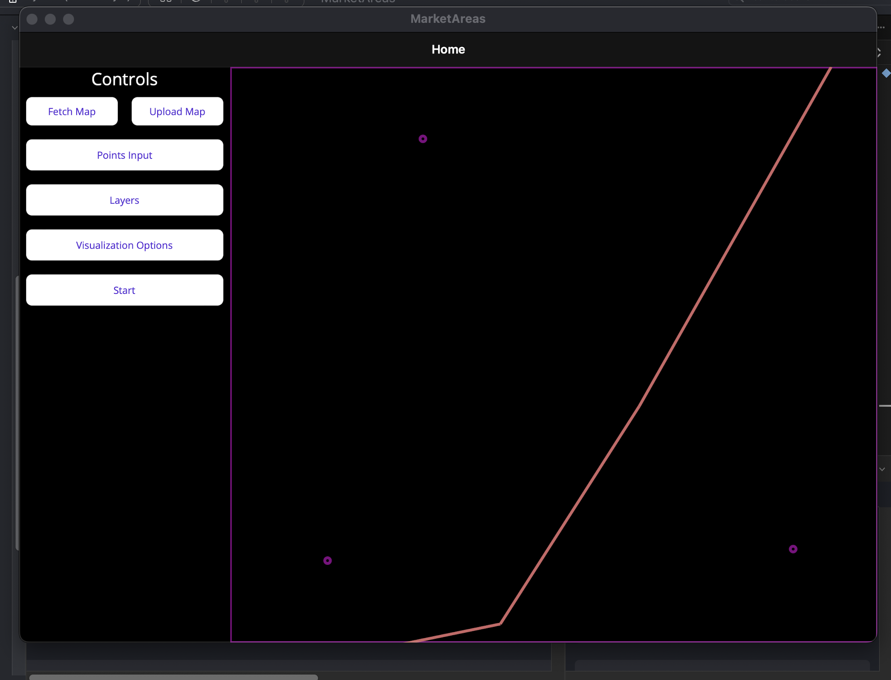
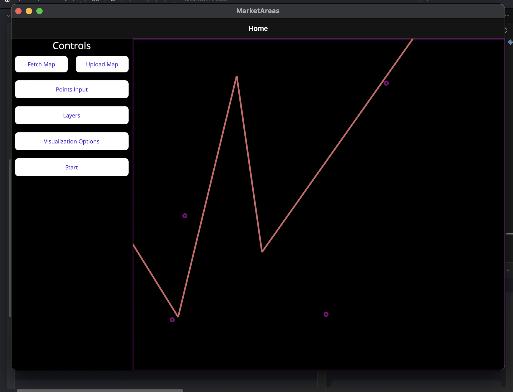
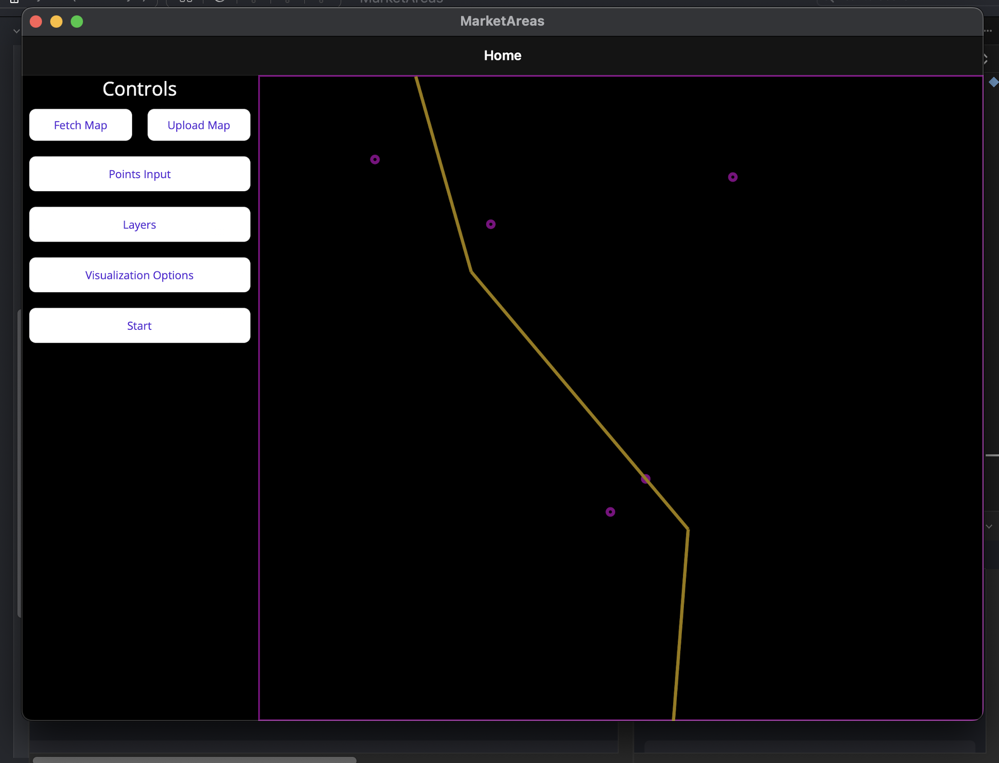
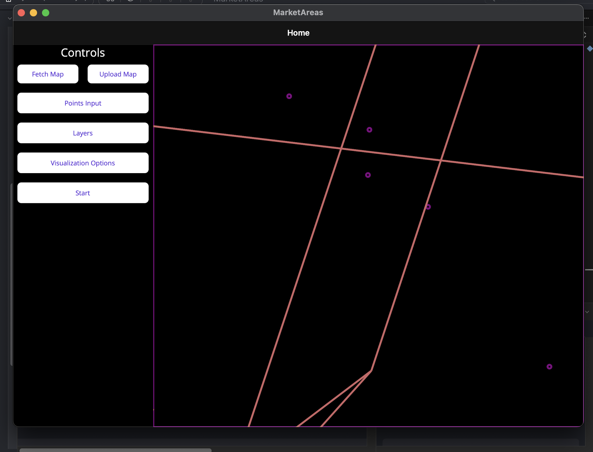
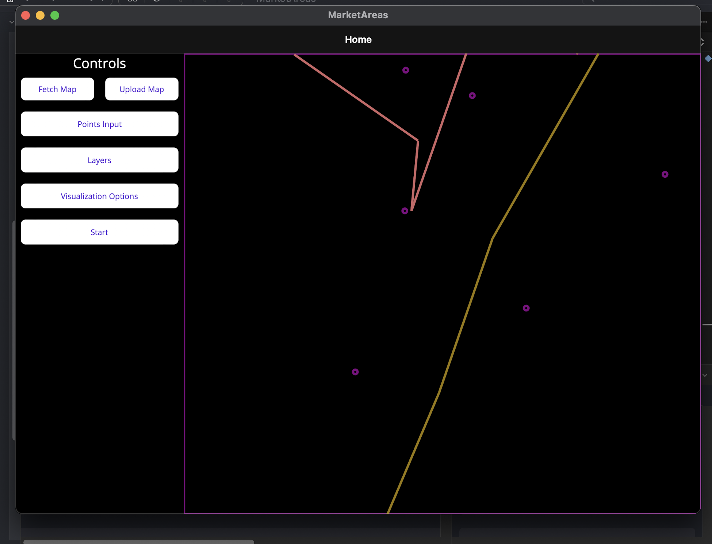
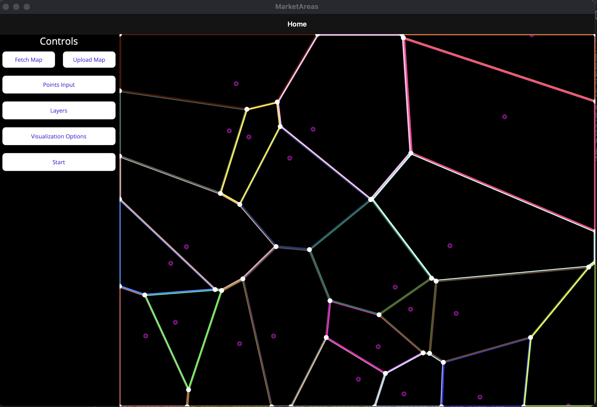
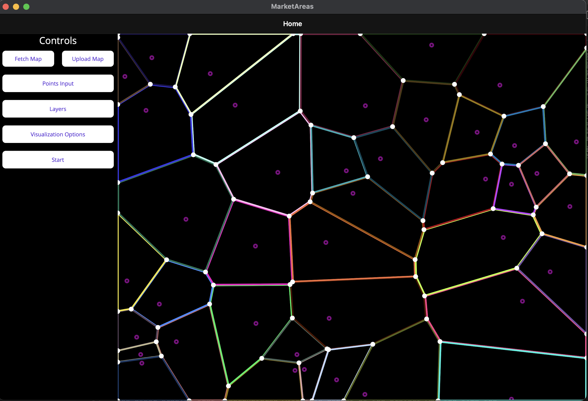
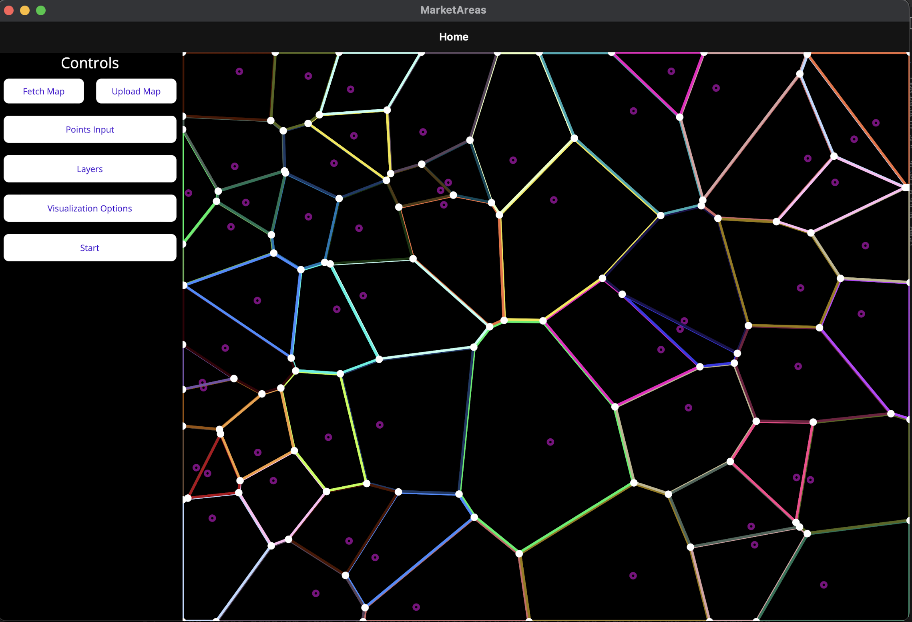

## Optimal Placement of Market Areas on Fantasy Town Maps

| Class Detail    | Information |
| --------------- | ----------- |
| `Course`        | CSCI 716 - Computational Geometry |
| `Team Members`  | Brock Dyer  |
| `Category`      | 3 - Applications in other fields |

## Proposal
Find an ideal set of n market locations within a region that optimize customer utility using weighted voronoi diagrams and metaheuristic search.

There are many digital tools to generate medieval town maps for fantasy worlds (my favorite being https://watabou.itch.io/medieval-fantasy-city-generator). These tools dramatically speed up the world building process for people that are lacking inspiration or artistic talent. The tool linked above includes some options for customizing the generator, such as the presence of rivers, the number of roads, if there is a castle and walls, etc... However, these tools do not provide an entire town. Although a pretty map is usually most of the battle for world-builders, it would be nice to have generators that can place markets, inns, and other necessities.

Voronoi diagrams are useful tools for subdividing a plane around focal points such that the cell region surrounding a centroid contains the points that are closer to that point than any other point. Consider a town with three markets. The regions of influence each market has could be approximated by a voronoi diagram using the market locations as centroids. This would be a very rough approximation because it would not account for various factors such as wealth distributions, the market’s size and power, and street distance to travel. The goal of this project is to optimize market placement based on such considerations.

Given an initial set of n market locations, use a voronoi diagram to approximate regions of influence. Then sample customer points within the influence region and evaluate a fitness function for those customers. This then becomes the basis of a search problem in which the best n market locations based on the fitness function is the goal of the search. Metaheuristic optimization algorithms such as the firefly algorithm have been shown to find sufficient solutions to these complex search problems in a tractable amount of time.

## Changes and Simplifications
To allow me to implement the entire project in time, I needed to simplify the scope. I decided to use uniformly weighted
voronoi sites instead of the weighted sites that I originally planned. The other task that I was not able to complete was
the loading of images into the application to visualize the results onto.

## Results

### My Attempt at Fortune's
I did my best to impelement Fortune's Algorithm myself. I believe that I nearly got a working implementation, however there are some clear bugs in the code. My beachline implementation was
working according to the tests that I had for it. However, I was not able to get a satisfactory
O(log(n)) implementation for this method. In time I believe that I could have figured one out, but I had to prioritize progress over perfection.

To the best of my understanding, the key issues with my implementation are not clipping segments
within the bounding box properly and missing some of the vertex events in the event queue.

### External Fortune's Implementation
Again prioritizing a working solution, I chose to use an external implementation for Fortune's Algorithm. This implementation returned a list of line segments that represented the bisectors between each site. I was able to take these segments and construct a doubly connected edge list
that allowed me to visualize each cell, and more importantly, query if a point was in a given cell.

### Optimization - Score Function
I ran short on time implementing the optimization routine and found that the sampling process that I had envisioned originally would require triangulation of each Voronoi Cell. Since I did not have time to thoroughly investigate that, I decided to just sample points within an approximation of the cell, and reject any point that was not contained inside it. This unfortunately leads to very random evaluations of any given voronoi diagram in terms of fitness for placing a market there. 

Future work on this project would be to better sample points in proportion to the area of each cell along with a better distribution across it.

### Optimization - Algorithm
Being short on time, I settled for a very basic optimization algorithm - hill climbing. This is a simple algorithm and is likely not the best choice for this problem space. However, it is sufficient for providing a somewhat decent solution. However, due to the flaws of the scoring function, I did not observe great results.

The other problem that I encountered with this aspect of the project was the time the optimization took. The combined inefficiencies of the scoring function, and the rudimentary optimization algorithm leads to a final product that is not very practical to use.

In the future I would like to return to this and see if it is possible to improve the performance of the optimization framework to something that is useable in real time (less than a few seconds).

## Final Thoughts
Through this project, I feel like I gained a very proficient understanding of voronoi diagrams and Fortune's Algorithm (despite the bugs in my implementation). I also got a chance to learn first-hand the importance of properly defining a scoring metric for metaheuristic optimization, which is valuable as in previous classes these metrics were always given to me.

## Project Demo and Presentation
https://youtu.be/3SgrUZ4pDR8

## References:
- Dr. K. Umadevi, Optimizing Rural Dealers location – A Voronoi Approach. International
Journal of Civil Engineering and Technology, 9(8), 2018, pp. 879-886. http://
www.iaeme.com/IJCIET/issues.asp?JType=IJCIET&VType=9&IType=8
- Wang Wei, Feng Xuejun and Huang Li, "Research on regional logistics system layout
 optimization based on weighted voronoi diagram and gravitational model," 2008 IEEE International Conference on Automation and Logistics, 2008, pp. 2078-2083, doi: 10.1109/ ICAL.2008.4636506.
- Yang XS (2008) Nature-inspired metaheuristic algorithms. Luniver Press, Beckington
- Yushimito, W.F., Jaller, M. & Ukkusuri, S. A Voronoi-Based Heuristic Algorithm for Locating
Distribution Centers in Disasters. Netw Spat Econ 12, 21–39 (2012). https://doi.org/ 10.1007/s11067-010-9140-9
- Fortune's Algorithm Implementation: https://github.com/Zalgo2462/VoronoiLib
